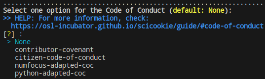
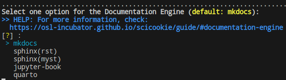

<!-- # ¡Descubre las emocionantes novedades que SciCookie ha implementado gracias a la subvención recibida de la PSF! -->

Como te comentamos en el post anterior [SciCookie recibe nueva subvención de
PSF para mejoras y
crecimiento](https://opensciencelabs.org/blog/scicookie-recibe-nueva-subvencion-de-psf-para-mejoras-crecimiento/),
en Enero de 2024 la PSF aprobó nuestra solicitud de subvención, lo que nos ha
permitido llevar a cabo una serie de mejoras significativas en SciCookie. En
esta etapa, nos complace compartir contigo los avances y las tareas que hemos
realizado para hacer de SciCookie una herramienta aún más poderosa y versátil.

<!-- TEASER_END -->

Una de las principales mejoras es la incorporación de **nuevas opciones de
herramientas a la plantilla**. En particular, hemos añadido los códigos de
conducta (CoC) de Python (adaptado) y de NumFOCUS para enriquecer las
alternativas disponibles. Además, ahora ofrecemos soporte para prettier como
otra opción de linter, brindando a los usuarios más flexibilidad y control
sobre sus proyectos.

En cuanto a la **estructura de la herramienta**, hemos realizado diversas optimizaciones.
Se ha implementado una opción condicional para las preguntas de uso de
herramientas en el proyecto (`depends_on`) y se ha corregido la indentación
en algunos archivos de configuración para mejorar la legibilidad del código.
También hemos unificado estos archivos según las distintas opciones de sistemas
de construcción (*build systems*) para evitar la repetición innecesaria de
código y texto (boilerplate). Asimismo, se ha creado un ejemplo para la opción
de Interfaz de línea de comandos (CLI) como base del contenido de ese archivo.

Otro aspecto fundamental en el que hemos trabajado es la **documentación**. Hemos
automatizado el proceso de mover archivos de configuración a la raíz del
proyecto manteniendo una estructura ordenada. Además, hemos dividido la
selección del motor de documentación sphinx en `sphinx-rst` y `sphinx-md(myst)`
para ofrecer opciones específicas a los usuarios. Se ha generado la
documentación de la API para estas opciones, se ha añadido `quarto` como un motor
de documentación adicional con su respectiva documentación de la API, y se han
incorporado distintos temas para cada motor de documentación disponible en la
plantilla.

Además, hemos iniciado el proceso de verificación de las sugerencias para la
revisión por pares de pyOpenSci y hemos establecido conversaciones con el
personal de esta organización. Este proceso sigue en marcha y esperamos obtener
valiosos comentarios para seguir mejorando SciCookie.

Con estos avances, esperamos que la comunidad encuentre en SciCookie una
herramienta aún más completa y adaptable a sus necesidades. Seguiremos
trabajando arduamente para ofrecer mejoras a nuestra comunidad de
código abierto.

Puedes consultar nuestro post [Collaborating and learning from
SciCookie](https://opensciencelabs.org/blog/scicookie-collaborating-and-learning/)
para conocer un poco más sobre la herramienta.

Mantente atento a futuras actualizaciones sobre SciCookie en próximos posts.
¡No te pierdas las emocionantes novedades que tenemos preparadas para ti!

Elementos gráficos de la portada fueron extraídos de [Job illustrations by
Storyset](https://storyset.com/job)
