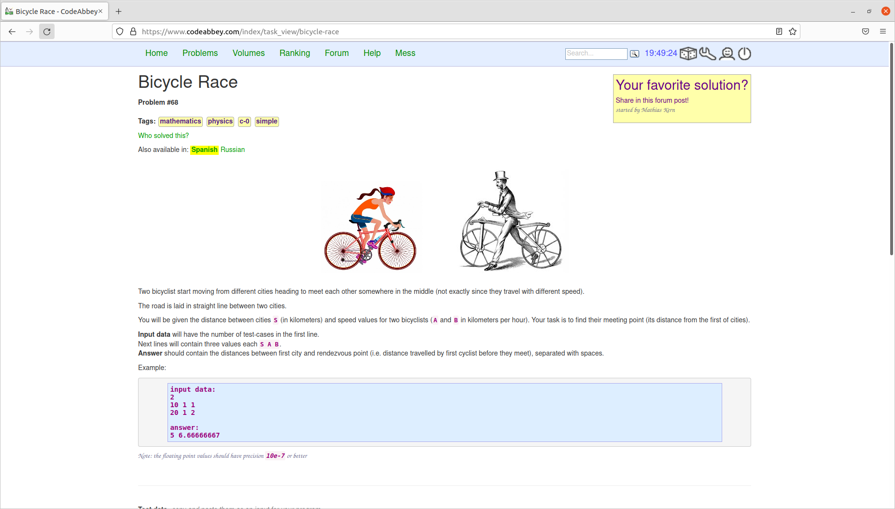
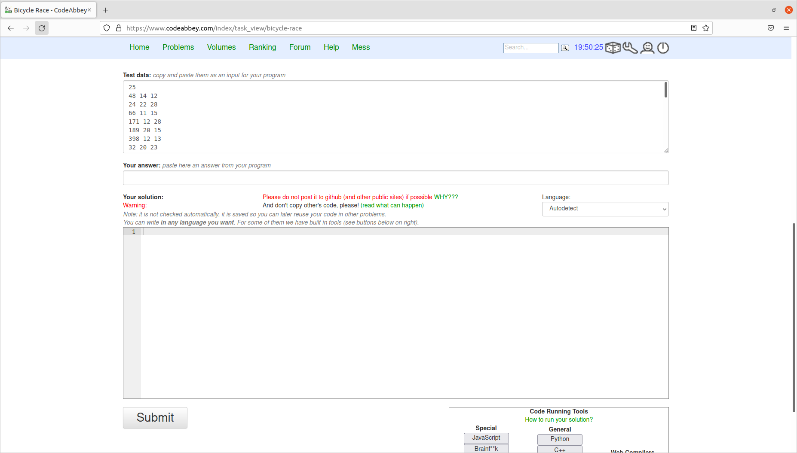

<!-- # Code Abbey una plataforma para mejorar tu habilidad en programación -->

Alguna vez te has pregundado, ¿Cómo puedo mejorar mis habilidades de
programación?. Este artículo tiene la respuesta, te mostraremos una de las
mejores plataformas para que puedas practicar programación resolviendo
problemas.

<!-- TEASER_END -->

## ¿Qué es Code Abbey ?

> Creemos que hay tres cosas que nos guían al éxito: Practica, Practica y
> ¡Practica!

[Code Abbey](https://www.codeabbey.com/) es una plataforma, impulsada y
mantenida por Rodion Gorkovenko con ayuda de la comunidad de Code Abbey,
contiene gran cantidad de problemas con dificultad variable, desde una simples
sumas, hasta algunas donde tienes que aplicar conceptos de Inteligencia
Artificial. Puedes resolver los problemas en varios lenguajes: C, C++, C#,
Python, Java, JavaScript e incluso con algunos menos conocidos como: Turing y
Brainf\*\*k.

## ¿Cómo funciona?

Puedes registrarte con una cuenta de gmail, facebook o de GitHub.

Un vez hecho el **Login** puedes ver los problemas haciendo click en la pestaña
**Problems**. Seleccionado el problema se te abrira la siguiente ventana:

La primera sección podrás ver el enunciado del problema y un ejemplo de entrada
y salida de lo solicitado. Cuando tengas la resolución del problema (script o
código), lo haces correr con los datos de entrada del test (**Test Data**).

La solución que arroje tu programa la copias en el espacio vacio de de **You
Answer**. Luego le puedes dar click a **Submit**, una vez se haya comprobado que
la respuesta es correcta, la resolución del problema será dada como válida.

Otra forma de verificar que tu código arroja la respuesta correcta es pegar el
código a la plataforma en el espacio vacio que encuentra por encima del boton
**Submit**, y hacerla correr con los botones que se encuentran en la parte
inferior derecha, haciendo click en el botón de tu lenguaje de programación hará
correr el script con los datos de test data y escribira la solución en la parte
de **Your Answer** y guardará tu código en la plataforma. Es recomendable
guardar el código en la plataforma incluso si no haces correr y sólo subes la
respuesta manualmente, esto permite la compobracion para lo administradores de
Code Abbey de que estas resolviendo los problemas por tu cuenta.

Una vez tu solución haya sido validada se te añadiran puntos de _Enlightment_
(que están calculados en base a la cantidad de personas que resolvieron el mismo
problema) y con base a los problemas resueltos se te asignará un rango dentro de
la comunidad.

> **Zealus Coder rank** Cuando resuelvas 120 problemas de los marcados con
> negrita o con la etiqueta c-1, puedes reclamar el certificado de **CodeAbbey
> Zealous Coder**, que certificará que resolviste los problemas difíciles de la
> plataforma. Como forma de motivar a que más mujeres entren al mundo de la
> programación, Code Abbey da un diploma honorario a las chicas que resuelvan 85
> problemas y el rango de **Fanatic Girl-Coder**.

## ¿Por qué resolver problemas en Code Abbey?

Muy aparte de la satifacción de resolver problemas, ascender rangos, pertenecer
a una comunidad y/o obtener un certificado que puedas presumir en tus redes. Se
tiene que tener en cuenta que la resolución de estos problemas, ayudan a afinar
tus habilidades en programación, porque para la resolución de los problemas se
requieren conocimientos de conceptos básicos, estadística, estructura de datos,
algoritmos de busqueda, ordenación, criptografía, teoría de números, entre
otros. Estos problemas, pueden ayudarte a prepararte para entrevistas y/o para
mejorar tu propio código, viendo cómo lo han resuelto los demás (esta opción se
habilita cuando tu solución sea tomada como válida).

## ¿Qué hacer cuando un problema es muy complicado?

Puedes ir a la sección de **Volumes** de la plataforma y darle una leida, y si
no basta puedes darle un vistazo a los siguientes recursos:

- [**CS50X**](https://pll.harvard.edu/course/cs50-introduction-computer-science?delta=0):
  Curso gratuito, ideal para los que empiezan a programar.
- **Python Crash Course - Eric Matthes**: Libro para iniciantes en python.
- [**Learn X in Y**](https://learnxinyminutes.com/). Recurso web para aprender
  cualquier lenguaje de programación.
- **Grokking algorithms- Aditya Bhargava**: Libro para preparte en problemas
  complicados.
- **Craking the Coding interview - Gayle Laskmann**: Libro para preparte en
  problemas complicados.

Libros para mejorar tus matemáticas

- **Mathematics for Computer Science - Eric Lehman and Tom Leighton**
- **Introduction to algorithms - Thomas H. Cormen**
- **Algorithm Design - Jon Kleinberg**

## ¿Sitios similares?

- [ROSALIND](https://rosalind.info/problems/locations/) Orientado a problemas de
  programación en Bioinformática.
- [Project Euler](https://projecteuler.net/) Contiene poblemas matemáticos y de
  programación.
- [algo.is](https://algo.is/) Problemas de competición de programación.
- [exercism](https://exercism.org/) Contiene problemas variados de programación.

## Referencias

[Code Abbey](https://www.codeabbey.com/)
