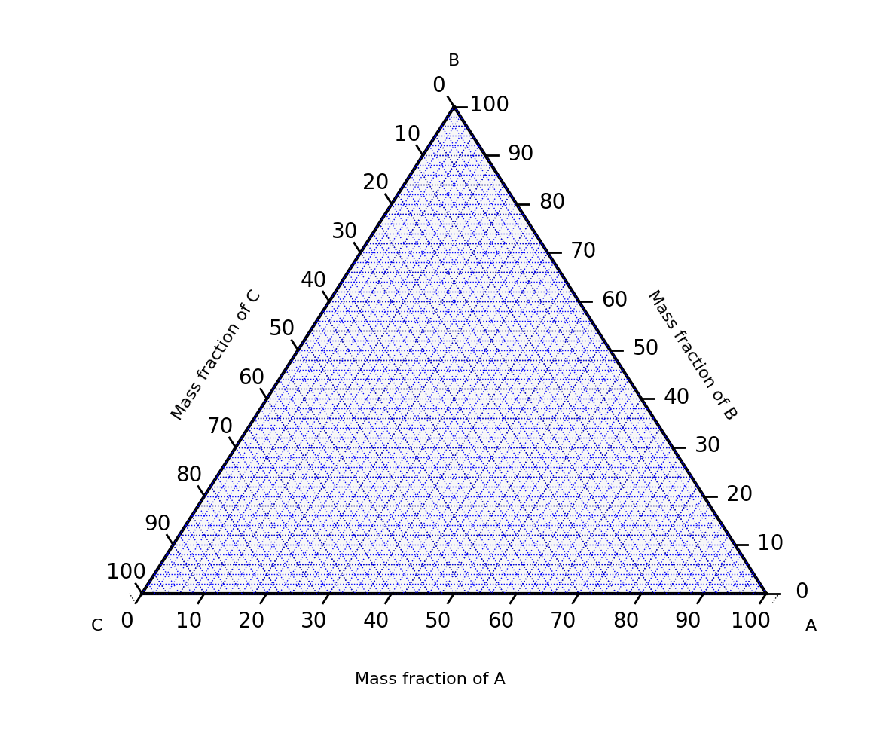
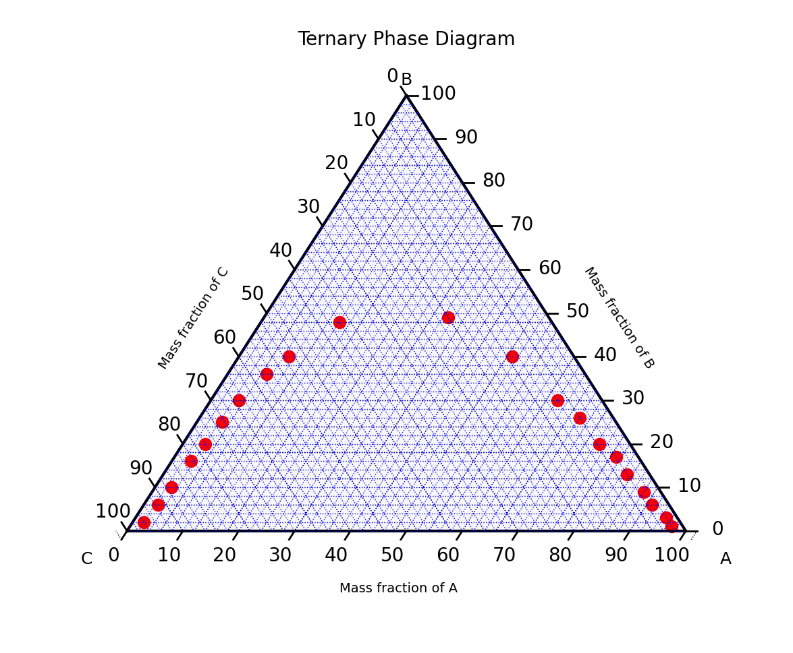
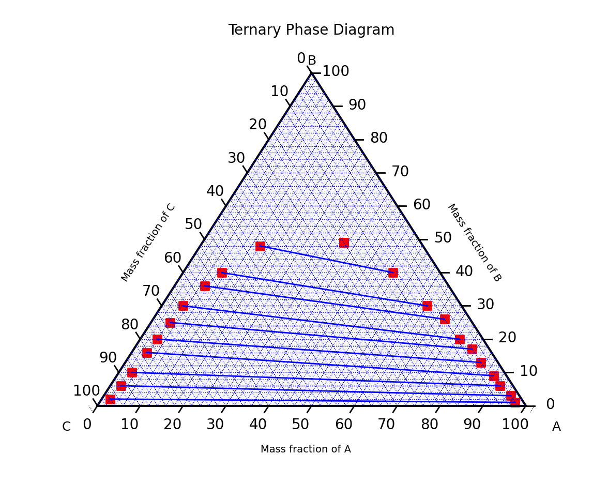
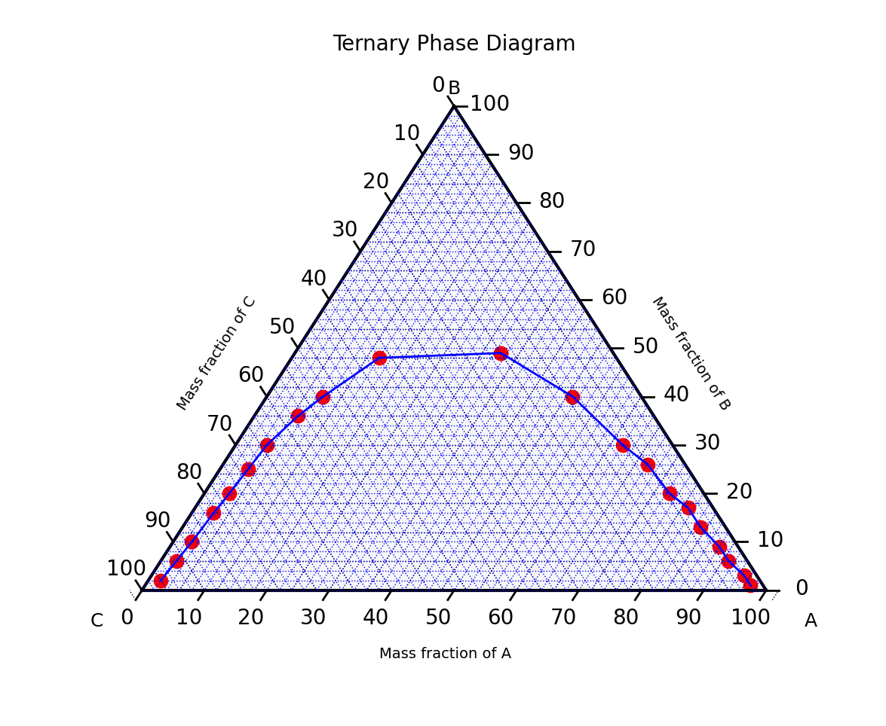
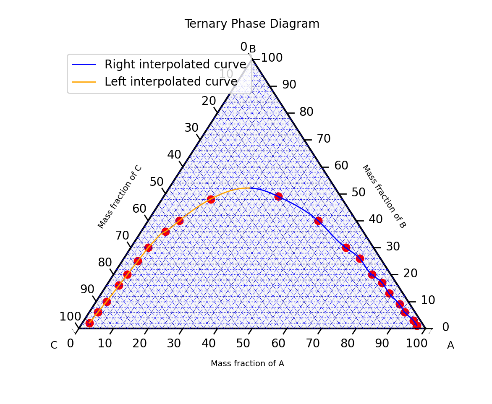

<!-- # Plotting ternary phase diagrams for solving thermodynamics problems using fqlearn -->

  An article on how to use the open source Fqlearn library to plot three phase diagrams used in thermodynamics, also known as ternary plots.

<!-- TEASER_END -->

## Introduction

During the Open Science Labs Q1 2024 internship, I worked on the Fqlearn project. [Fqlearn](https://github.com/osl-pocs/fqlearn) is an open source python library, currently in development, which aims to facilitate the teaching of mass transfer and thermodynamics.

My main task involved developing methods to use a three phase diagram to solve thermodynamics problems graphically. For this purpose, I wrote code for the [`ThreeComponent.py`](https://github.com/osl-pocs/fqlearn/blob/main/src/fqlearn/ThreeComponent.py) class, as well as corresponding [tests](https://github.com/osl-pocs/fqlearn/blob/main/tests/test_three_component.py) for the class.

### Ternary phase diagram

A ternary plot, ternary graph, triangle plot, simplex plot, or Gibbs triangle is a barycentric plot on three variables which sum to a constant. It graphically depicts the ratios of the three variables as positions in an equilateral triangle. It is used in physical chemistry, petrology, mineralogy, metallurgy, and other physical sciences to show the compositions of systems composed of three species. Ternary plots are tools for analyzing compositional data in the three-dimensional case [[1](https://en.wikipedia.org/wiki/Ternary_plot)].



In a ternary plot, the values of the three variables a, b, and c must sum to some constant, K. Usually, this constant is represented as 1.0 or 100%. Because a + b + c = K for all substances being graphed, any one variable is not independent of the others, so only two variables must be known to find a sample's point on the graph: for instance, c must be equal to K − a − b. Because the three numerical values cannot vary independently—there are only two degrees of freedom—it is possible to graph the combinations of all three variables in only two dimensions.

The advantage of using a ternary plot for depicting chemical compositions is that three variables can be conveniently plotted in a two-dimensional graph. Ternary plots can also be used to create phase diagrams by outlining the composition regions on the plot where different phases exist [[1](https://en.wikipedia.org/wiki/Ternary_plot)]. 

## Methods

To begin with, we import the libraries required for plotting ternary phase diagrams. We used [`python-ternary`](https://github.com/marcharper/python-ternary), a plotting library that uses matplotlib to make ternary plots. Using this library, many features could be added to the fqlearn library for various purposes, as described in this article.

```python
import matplotlib as plt
import numpy as np
import ternary
from scipy.interpolate import CubicSpline
```

Then we define our class, `ThreeComponent`, in which we create some functions, a few of which will be explained in this article. To see how these functions work, we create some variables, which are lists containing an unordered list of tuples, each containing 3 values, representing the x, y and z values in the form `[(x,y,z)]`.

```python
right_eq_line = [(0.02, 0.02, 0.96), (0.025, 0.06, 0.915), (0.03, 0.1, 0.87), 
                (0.035, 0.16, 0.805), (0.04, 0.2, 0.76), (0.045, 0.25, 0.705), 
                (0.05, 0.3, 0.65), (0.07, 0.36, 0.57), (0.09, 0.4, 0.51), 
                (0.14, 0.48, 0.38), (0.33, 0.49, 0.18)]
left_eq_line = [(0.97, 0.01, 0.02), (0.95, 0.03, 0.02), (0.91, 0.06, 0.03), 
                (0.88, 0.09, 0.03), (0.83, 0.13, 0.04), (0.79, 0.17, 0.04), 
                (0.745, 0.2, 0.055), (0.68, 0.26, 0.06), (0.62, 0.3, 0.08), 
                (0.49, 0.4, 0.11), (0.33, 0.49, 0.18)]

points = left_eq_line + right_eq_line
```

We also set the scale of our plot to 100 in the `__init__ function`. This is the value that each tuple must sum up to.

```python
self.scale = 100
```

To start using the Three Component class, we can use the following code:

```python
from fqlearn import ThreeComponent
model = ThreeComponent()
```

We can then call the functions as needed. We define a function `sort_points` that sorts the values it receives as an argument. The points are added using the `add_point` function, which ensures that the argument is not an empty list, removes duplicate tuples, and multiplies each point in the tuple by the scale. 

```python
def add_point(self, points):
    # Check if points is an empty list
    if not points:
        raise ValueError(
            "The 'points' list cannot be empty. Please provide valid points."
        )

    # Remove duplicate points
    points_to_plot = list(set(points))

    # Multiply each point by the scale
    points_to_plot = [
        (x * self.scale, y * self.scale, z * self.scale)
        for x, y, z in points_to_plot
    ]

    # Add the points to the plot
    self.tax.scatter(points_to_plot, linewidth=1.0, marker="o", color="red")
    return points_to_plot
```

The `sort_points` function sorts the tuples using the x value in each tuple, then adds them to a new list. This allows us to have the tuples sorted in ascending order along the x-axis. The function also ensures that all points in the tuple(s) in the sorted list add up to the scale.

```python
def sort_points(self, points):
    points_to_plot = self.add_point(points)
    # Sort the points in ascending order
    xyz = [(x, y, z) for x, y, z in points_to_plot]
    sorted_points = sorted(xyz, key=lambda m: m[0])

    # New list to store sorted points
    new_sorted_points = []

    # Check if the points are in a list of lists or a single list
    if isinstance(
        sorted_points[0], (int, float)
    ):  # Check if the first element of points is a number
        assert sorted_points[0] + sorted_points[1] + sorted_points[2] == self.scale
        new_sorted_points.append(sorted_points)
    else:
        # If the points are in a list of lists
        for sorted_point in sorted_points:
            assert sorted_point[0] + sorted_point[1] + sorted_point[2] == self.scale
            new_sorted_points.append(sorted_point)

    # Add the points to the plot
    self.tax.scatter(new_sorted_points, linewidth=1.0, marker="o", color="red")
    return new_sorted_points
```

If we print the returned values, we get the following output, where each tuple is arranged in ascending order according to the x values:
```console
[(2.0, 2.0, 96.0), (2.5, 6.0, 91.5), (3.0, 10.0, 87.0), (3.5000000000000004, 16.0, 80.5), (4.0, 20.0, 76.0), (4.5, 25.0, 70.5), (5.0, 30.0, 65.0), (7.000000000000001, 36.0, 56.99999999999999), (9.0, 40.0, 51.0), (14.000000000000002, 48.0, 38.0), (33.0, 49.0, 18.0), (49.0, 40.0, 11.0), (62.0, 30.0, 8.0), (68.0, 26.0, 6.0), (74.5, 20.0, 5.5), (79.0, 17.0, 4.0), (83.0, 13.0, 4.0), (88.0, 9.0, 3.0), (91.0, 6.0, 3.0), (95.0, 3.0, 2.0), (97.0, 1.0, 2.0)]
```

We can then call the `plot` function, to plot the ternary phase diagram in order to visualize the plotted points.

```python
def plot(self):
    self.tax.clear_matplotlib_ticks()
    self.tax.get_axes().axis("off")
    self.tax.legend()
    ternary.plt.show()
```

We obtain the ternary plot shown below:



We define the `composition_line` function which plots equilibrium lines joining the tuples corresponding to the two compositions in each index in the list of tuples. This function first multiplies each point in each tuple by the scale, then sorts the list of the left composition in ascending order, and the list of the right composition in descending order. For each tuple, the x, y and z values are extracted, then joined using equilibrium lines.

```python
def composition_line(self, left_eq_line, right_eq_line):
    # Multiply each point by the scale
    new_left_eq_line = [
        (x * self.scale, y * self.scale, z * self.scale) for x, y, z in left_eq_line
    ]
    new_right_eq_line = [
        (x * self.scale, y * self.scale, z * self.scale)
        for x, y, z in right_eq_line
    ]

    # Sort the left points in ascending order
    xyz = [(x, y, z) for x, y, z in new_left_eq_line]
    sorted_left_eq_line = sorted(xyz, key=lambda m: m[0])
    # Sort the right points in descending order
    xyz = [(x, y, z) for x, y, z in new_right_eq_line]
    sorted_right_eq_line = sorted(xyz, key=lambda m: m[0], reverse=True)

    for i in range(len(left_eq_line)):
        # Ensure all points add up to the scale
        pointA = sorted_left_eq_line[i]
        assert sum(pointA) == self.scale
        pointB = sorted_right_eq_line[i]
        assert sum(pointB) == self.scale

        # Extract x and y coordinates of each point
        xA, yA, zA = pointA
        xB, yB, zB = pointB

        # Add the two points to the plot
        self.tax.scatter([(xA, yA, zA), (xB, yB, zB)], marker="s", color="red")
        # Plot a line connecting the two points
        self.tax.plot(
            [(xA, yA, zA), (xB, yB, zB)],
            linewidth=1.0,
            color="blue",
        )
```

We obtain the following ternary plot:



We can calculate the slope of the equilibrium lines plotted above using the function `eq_slope`. We loop through each tuple of each composition in each index, extract the x and y values, and find the slope, by dividing the change in y by the change in x for each index. The function returns the average slope.

```python
def eq_slope(self, right_eq_line, left_eq_line):
    # Multiply each point by the scale
    right_eq_line = [
        (x * self.scale, y * self.scale, z * self.scale)
        for x, y, z in right_eq_line
    ]
    left_eq_line = [
        (x * self.scale, y * self.scale, z * self.scale) for x, y, z in left_eq_line
    ]

    # Sort the right points in ascending order
    xyz = [(x, y, z) for x, y, z in right_eq_line]
    right_eq = sorted(xyz, key=lambda m: m[0])
    # Sort the left points in descending order
    xyz = [(x, y, z) for x, y, z in left_eq_line]
    left_eq = sorted(xyz, key=lambda m: m[0], reverse=True)

    slopes = []

    for i in range(len(right_eq_line)):
        pointA = right_eq[i]
        assert sum(pointA) == self.scale
        pointB = left_eq[i]
        assert sum(pointB) == self.scale

        # Extract x and y coordinates of each point
        xA, yA, _ = pointA
        xB, yB, _ = pointB

        # Calculate the slope of the line joining the points
        if xA - xB != 0:  # Check for vertical line
            slope = (yA - yB) / (xA - xB)
            slopes.append(slope)
        else:
            # For vertical lines, return None for slope
            slopes.append(0)
    print("Slope = ", slopes)

    # Calculate average of the slopes
    avg_slope = sum(slopes) / len(slopes)
    print("Average slope = ", avg_slope)
    return avg_slope
```

We obtain the following output:
```console
Slope =  [-0.010526315789473684, -0.032432432432432434, -0.045454545454545456, -0.08284023668639054, -0.08860759493670886, -0.10738255033557047, -0.14388489208633093, -0.16393442622950818, -0.18867924528301888, -0.22857142857142856, 0]
Average slope =  -0.09930124252776436
```

We can also plot a ternary phase diagram with an equilibrium line joining all the plotted points, like in a graph, by calling the `add_eq_line` function.

```python
def add_eq_line(self, right_eq_line, left_eq_line):
    # Add the points
    self.right_eq_line = self.sort_points(right_eq_line)
    self.left_eq_line = self.sort_points(left_eq_line)
    eq_line = self.right_eq_line + self.left_eq_line

    # Remove duplicate points
    eq_line_plot = list(set(eq_line))

    # Sort the points in ascending order
    xyz = [(x, y, z) for x, y, z in eq_line_plot]
    sorted_eq = sorted(xyz, key=lambda m: m[0])

    self.tax.plot(sorted_eq, linewidth=1.0, color="blue", label="Equilibrium line")
```

We get the ternary plot below:



However, the equilibrium line plotted above is not smooth. To generate a smooth line, we use the `interpolate_points` function. 

We first sort the points using the `sort_points` function. Then we extract the x and y values from the sorted points, ignoring the z values which will not be used. Variable `x` becomes a list of all x values and variable `y` becomes a list of all y values. After that, we perform cubic spline interpolation on the x and y values using the CubicSpline function, imported from the scipy.interpolate module of SciPy's library [[2](https://docs.scipy.org/doc/scipy/reference/generated/scipy.interpolate.CubicSpline.html)]. `bc_type="natural"` specifies the natural boundary conditions, meaning the second derivative of the spline at the boundaries will be set to zero. `x_cubic` is set to a linearly spaced array of values ranging from 0 to 100 with 100 number of points, which is the value of `self.scale`, and `y_cubic` contains the corresponding y values interpolated using the cubic spline function `f`. Then we filter out any points outside the specified range of 0 to 100 for both `x_cubic` and `y_cubic`, and use the `np.column_stack` function to combine `x_cubic` and `y_cubic` into a single 2D array, which is returned by the function as `interpolated_points`.

```python
def interpolate_points(self, points):
    sorted_points = self.sort_points(points)

    # Cubic spline interpolation
    x = [x for x, y, _ in sorted_points]
    y = [y for x, y, _ in sorted_points]

    f = CubicSpline(x, y, bc_type="natural")
    x_cubic = np.linspace(0, self.scale, self.scale)
    y_cubic = f(x_cubic)

    # Remove negative points
    interpolated_points = [
        [i, j]
        for i, j in np.column_stack((x_cubic, y_cubic))
        if 0 <= i <= self.scale and 0 <= j <= self.scale
    ]

    return interpolated_points
```        

Printing the output of the function, we obtain the output below, showing the interpolated points:
```console
[[2.0202020202020203, 2.1691472640742586], [3.0303030303030303, 10.329514857514697], [4.040404040404041, 20.340775738329878], [5.050505050505051, 30.41604117022922], [6.0606060606060606, 34.9725244736696], [7.070707070707071, 36.0788150823154], [8.080808080808081, 37.866519430111914], [9.090909090909092, 40.207639450509895], [10.101010101010102, 42.33305618527275], [11.111111111111112, 44.15164951408806], [12.121212121212121, 45.70152886497335], [13.131313131313131, 47.02080366594621], [14.141414141414142, 48.147569717383064], [15.151515151515152, 49.11261947676193], [16.161616161616163, 49.927423194367556], [17.171717171717173, 50.600292249170636], [18.181818181818183, 51.13953802014185], [19.191919191919194, 51.55347188625187], [20.202020202020204, 51.850405226471395], [21.212121212121215, 52.038649419771076], [22.222222222222225, 52.12651584512162], [23.232323232323235, 52.122315881493684], [24.242424242424242, 52.03436090785797], [25.252525252525253, 51.87096230318516], [26.262626262626263, 51.640431446445916], [27.272727272727273, 51.35107971661092], [28.282828282828284, 51.011218492650855], [29.292929292929294, 50.62915915353641], [30.303030303030305, 50.213213078238255], [31.313131313131315, 49.771691645727074], [32.323232323232325, 49.31290623497355], [33.333333333333336, 48.84510804535748], [34.343434343434346, 48.37284930204433], [35.35353535353536, 47.89489752249601], [36.36363636363637, 47.409516570717145], [37.37373737373738, 46.91497031071236], [38.38383838383839, 46.40952260648627], [39.3939393939394, 45.891437322043494], [40.40404040404041, 45.358978321388655], [41.41414141414142, 44.81040946852637], [42.42424242424243, 44.24399462746127], [43.43434343434344, 43.65799766219796], [44.44444444444445, 43.050682436741056], [45.45454545454546, 42.4203128150952], [46.46464646464647, 41.765152661265006], [47.47474747474748, 41.083465839255076], [48.484848484848484, 40.373516213070054], [49.494949494949495, 39.63371670174959], [50.505050505050505, 38.86607499990182], [51.515151515151516, 38.076288591118626], [52.525252525252526, 37.270223020764256], [53.535353535353536, 36.45374383420295], [54.54545454545455, 35.63271657679892], [55.55555555555556, 34.81300679391643], [56.56565656565657, 34.000480030919704], [57.57575757575758, 33.201001833172974], [58.58585858585859, 32.42043774604049], [59.5959595959596, 31.664653314886465], [60.60606060606061, 30.93951408507516], [61.61616161616162, 30.250885601970786], [62.62626262626263, 29.60336029919871], [63.63636363636364, 28.983912044764498], [64.64646464646465, 28.366648419185424], [65.65656565656566, 27.72538388514391], [66.66666666666667, 27.0339329053224], [67.67676767676768, 26.26610994240331], [68.68686868686869, 25.39917799115036], [69.6969696969697, 24.44860975371087], [70.70707070707071, 23.453665293050822], [71.71717171717172, 22.45396405508463], [72.72727272727273, 21.489125485726685], [73.73737373737374, 20.59876903089141], [74.74747474747475, 19.822230508859366], [75.75757575757576, 19.162761793258028], [76.76767676767678, 18.552564414178864], [77.77777777777779, 17.915539652280298], [78.7878787878788, 17.175588788220747], [79.7979797979798, 16.27016258697005], [80.80808080808082, 15.240129979240486], [81.81818181818183, 14.174027140890017], [82.82828282828284, 13.160644754568583], [83.83838383838385, 12.27416074496895], [84.84848484848486, 11.4905826393484], [85.85858585858587, 10.745488901010873], [86.86868686868688, 9.974332435176901], [87.87878787878789, 9.112566147067007], [88.8888888888889, 8.11684009659671], [89.89898989898991, 7.065697936762742], [90.90909090909092, 6.081168542871885], [91.91919191919193, 5.257512388433542], [92.92929292929294, 4.543021889369125], [93.93939393939395, 3.8382841183777483], [94.94949494949496, 3.043859233178794], [95.95959595959597, 2.0885249765853326], [96.96969696969697, 1.0322241687602192]]
```

Next, we define a function, `div_half`, to divide an equilibrium line in half, and thus dividing the interpolated points in the left side from those in the right side. Before that, we define some helper functions, `derivative` and `min_diff`. 

The `derivative` function extracts the x and y values, then calculates the n-th discrete difference between these values using NumPy's np.diff [[3](https://numpy.org/doc/stable/reference/generated/numpy.diff.html)]. The first value of dydx is given by dydx[i] = (y[i+1] - y[i])/(x[i+1] - x[i]) along the given axis and higher differences are calculated by using np.diff recursively.

```python
def derivative(self, points):
    points_to_derive = self.interpolate_points(points)

    # Extract x and y values
    x = [x for x, _ in points_to_derive]
    y = [y for _, y in points_to_derive]

    # Calculate derivative
    dydx = np.diff([y]) / np.diff([x])

    return dydx
```

We can print out dydx to see the output:
```console
[[ 8.07876392e+00  9.91114827e+00  9.97451278e+00  4.51091847e+00
   1.09522770e+00  1.76982730e+00  2.31770882e+00  2.10416257e+00
   1.80040740e+00  1.53438056e+00  1.30608205e+00  1.11549839e+00
   9.55399262e-01  8.06655680e-01  6.66140364e-01  5.33853313e-01
   4.09794527e-01  2.93964007e-01  1.86361751e-01  8.69877611e-02
  -4.15796399e-03 -8.70754239e-02 -1.61764619e-01 -2.28225548e-01
  -2.86458213e-01 -3.36462612e-01 -3.78238746e-01 -4.11786615e-01
  -4.37106218e-01 -4.54197557e-01 -4.63120208e-01 -4.67536156e-01
  -4.73172262e-01 -4.80527142e-01 -4.89600797e-01 -5.00393227e-01
  -5.12904432e-01 -5.27134411e-01 -5.43083164e-01 -5.60750693e-01
  -5.80136996e-01 -6.01242073e-01 -6.24065925e-01 -6.48608552e-01
  -6.74869954e-01 -7.02850130e-01 -7.32401516e-01 -7.59965285e-01
  -7.81888545e-01 -7.98004915e-01 -8.08314395e-01 -8.12816985e-01
  -8.11512685e-01 -8.04401495e-01 -7.91483416e-01 -7.72758446e-01
  -7.48226587e-01 -7.17887838e-01 -6.81742198e-01 -6.41050050e-01
  -6.13253772e-01 -6.11090989e-01 -6.34851889e-01 -6.84536470e-01
  -7.60144733e-01 -8.58262632e-01 -9.41062555e-01 -9.84995016e-01
  -9.89704226e-01 -9.55190184e-01 -8.81452890e-01 -7.68773137e-01
  -6.52874028e-01 -6.04095405e-01 -6.30654514e-01 -7.32551355e-01
  -8.96371939e-01 -1.01973228e+00 -1.05544181e+00 -1.00324856e+00
  -8.77619170e-01 -7.75742325e-01 -7.37642801e-01 -7.63444901e-01
  -8.53148625e-01 -9.85768790e-01 -1.04063074e+00 -9.74684100e-01
  -8.15419593e-01 -7.07345594e-01 -6.97690393e-01 -7.86480636e-01
  -9.45780914e-01 -1.04573780e+00]]
```

Then we use the `min_diff` function to find the index of the point that is at the centre of the equilibrium line, which divides it into 2 halves. Starting with an index value of zero and a minimum difference given by the difference between the absolute of the first `dydx` value and the average slope, we iterate over the indices of `dydx` to find the index of the `dydx` value which is closest to the average slope `avg_slope`.

```python
def min_diff(self, right_eq_line, left_eq_line):
    self.points = right_eq_line + left_eq_line
    dydx = self.derivative(self.points)
    avg_slope = self.eq_slope(right_eq_line, left_eq_line)

    min_index = 0
    # Initialize min_diff_value with the first element difference
    min_diff_value = abs(dydx[0][0] - avg_slope)

    # Iterate over indices of dydx
    for index in range(0, dydx.size):
        diff = abs(dydx[0][index] - avg_slope)
        if diff < min_diff_value:
            min_diff_value = diff
            min_index = index

    return min_index
```

We then define the `div_half` function that divides the equilibrium line precisely in half. We use the interpolated points from the `interpolate_points` function, which ensures that the point of division is very precise. Then we use the `min_diff` function to obtain the index of the point dividing the equilibrium line in half. Using this index, we can halve the interpolated points, and plot two equilibrium lines on the right and left side of the ternary plot using these points.

```python
def div_half(self, right_eq_line, left_eq_line):
    # Add the points
    self.points = right_eq_line + left_eq_line
    interpolated_points = self.interpolate_points(self.points)

    # Use index to separate right and left side
    index = self.min_diff(right_eq_line, left_eq_line)
    self.interpolated_right_side = interpolated_points[index:]
    self.interpolated_left_side = interpolated_points[: index + 1]

    # Plot the curve
    self.tax.plot(
        self.interpolated_right_side,
        linewidth=1.0,
        color="blue",
        label="Right interpolated curve",
    )
    self.tax.plot(
        self.interpolated_left_side,
        linewidth=1.0,
        color="orange",
        label="Left interpolated curve",
    )
```

We obtain the following ternary plot:



## Acknowledgements
I would like to thank the [Open Science Labs](https://opensciencelabs.org/) and The Graph Network for giving me the opportunity to learn and gain experience in open source through this internship. I also thank [Ever Vino](https://github.com/EverVino) for his guidance and mentorship throughout this internship program. If you would like to connect with me, you can find me on [LinkedIn](https://www.linkedin.com/in/faithhunja), or check out my [personal website](https://faithhunja.github.io/).

## References

[1] Ternary plots - Wikipedia: <https://en.wikipedia.org/wiki/Ternary_plot>

[2] scipy.interpolate.CubicSpline - SciPy v1.13.1 Manual: <https://docs.scipy.org/doc/scipy/reference/generated/scipy.interpolate.CubicSpline.html>

[3] numpy.diff - NumPy v1.26 Manual: <https://numpy.org/doc/stable/reference/generated/numpy.diff.html>