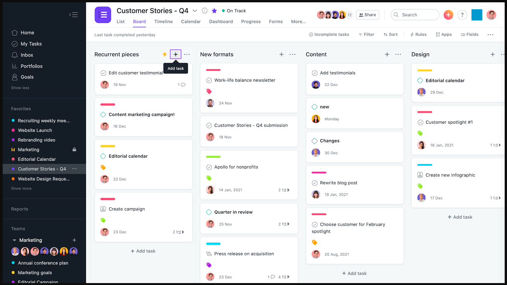
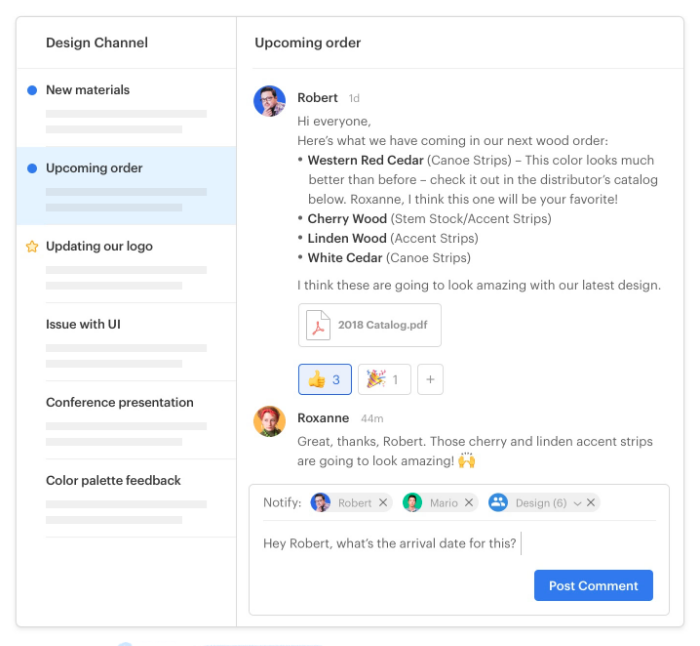
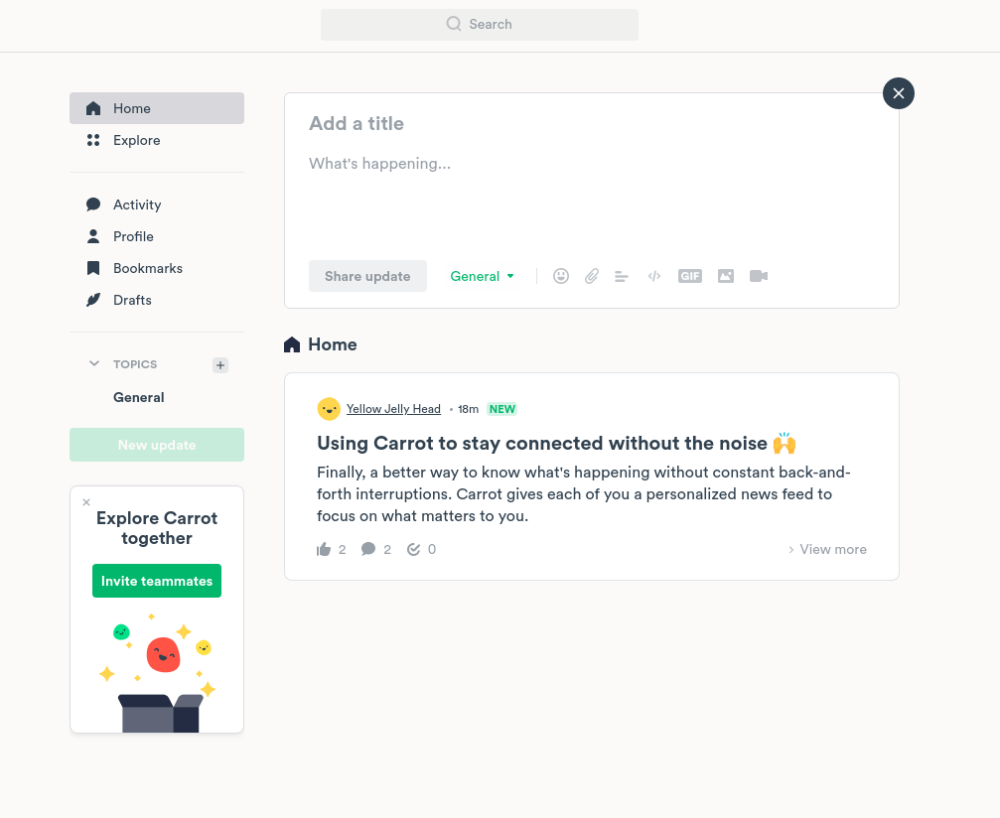
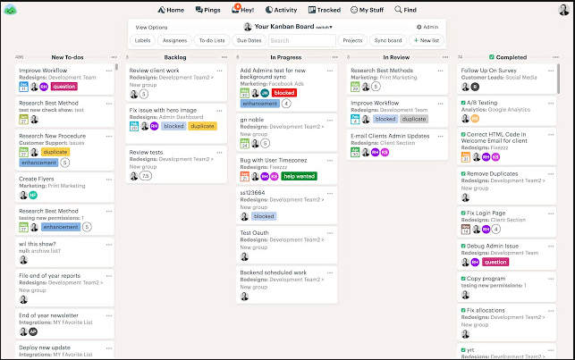
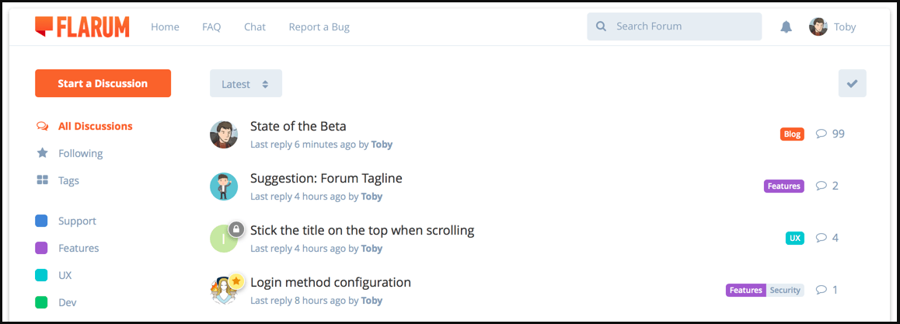
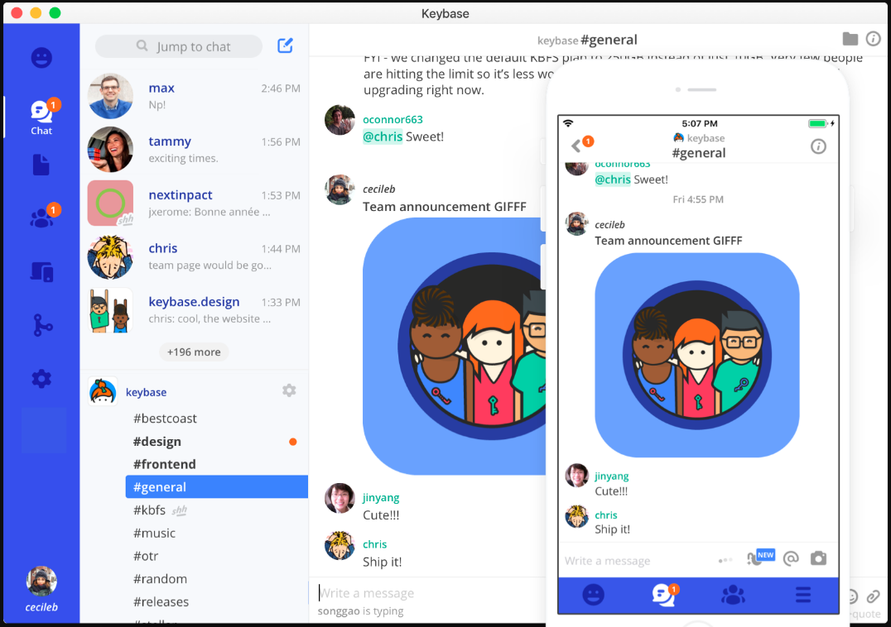
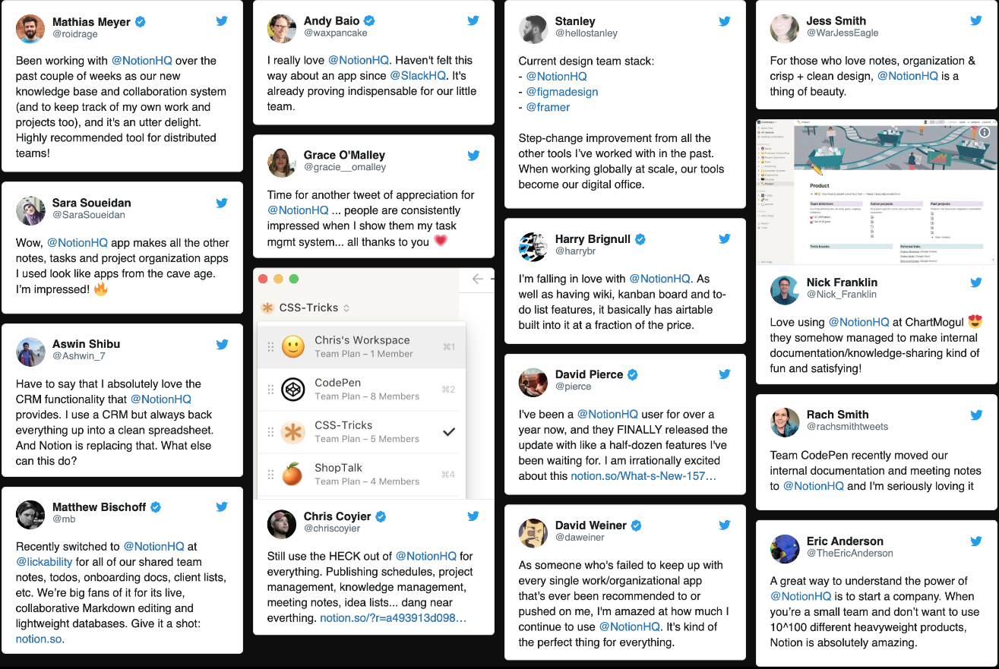

<!-- # 10 Plataformas que te ayudarán en la gestión de tu grupo de trabajo. -->

El manejo de los equipos de trabajo es interés constante para Open Science Labs,
porque tenemos la convicción de que un equipo de trabajo bien manejado puede
crecer en conjunto y construir mejores resultados para la ciencia abierta.

<!-- TEASER_END -->

Ya en artículos anteriores hemos hablado de
[las herramientas que pueden utilizarse en el manejo de investigación reproducible](https://opensciencelabs.org/blog/como-aplicar-la-investigacion-reproducible-proyectos-de-codigo-abierto/)
en equipos de trabajo, o
[cuáles son los aspectos clave a tener en cuenta en el manejo de equipos de ciencia abierta](https://opensciencelabs.org/blog/aspectos-clave-en-el-manejo-de-equipos-de-ciencia-abierta/),
y en este artículo queremos profundizar un poco más y mostrarte nuestra
perspectiva del propósito de examinar no solo las herramientas utilizadas, sino
también las prácticas de trabajo en equipo.

## Los equipos de trabajo y su organización

Recientemente ha sido muy difundido
[este artículo](https://critter.blog/2021/01/12/if-it-matters-after-today-stop-talking-about-it-in-a-chat-room/))
en el cual Mike Crittenden muestra su perspectiva sobre las herramientas que se
utilizan en las comunicaciones internas y de cómo unas prácticas comunicativas
inadecuadas pueden conducir a retrabajo y estrés en los equipos.

La premisa del autor en su artículo es que, en muchas ocasiones, la comunicación
en los equipos de trabajo genera un problema adicional cuando algunos temas, que
deberían trabajarse en mayor profundidad y con mayor dedicación, se acumulan al
verterse en herramientas pensadas para conversaciones breves y puntuales.

Este _problema adicional_ que mencionamos tiene varias aristas. En primer lugar,
muchas de las herramientas de colaboración pensadas para equipos de desarrollo
tienen, además de las conexiones con repositorios, espacios de chats (canales)
para que los equipos puedan tener un espacio de conversación. Sin embargo, estos
chats que están generalmente pensados para conversaciones de alcance temporal
corto, no cuentan con dispositivos que faciliten su seguimiento y, pese a ello,
terminan utilizándose para conversaciones que pueden nutrirse de ser llevadas,
por ejemplo, a través de una discusión en el manejador de _issues_ de los
proyectos en una plataforma como [Github](http://github.com).

Vaciar conversaciones con detalles técnicos, diálogos en grupos de chat, en
ocasiones conversaciones paralelas, interrumpidas por cualquier integrante del
grupo con algún sticker o pregunta no relacionada, sin lugar a dudas hacen mucho
más complicado llevar el seguimiento a detalles que, por ser determinantes para
el desempeño del equipo o de alguna tarea, seguro se benefician de un trabajo
más individualizado en un espacio que posibilite su seguimiento y
sistematización posteriores.

No vamos a construir una crítica a ultranza del uso de chats en las
comunicaciones grupales, de hecho, tienen un papel muy importante en el
tratamiento de decisiones muy puntuales, recordatorios o incluso, con propósitos
de distensión y relajación, especialmente si se trabaja de forma remota. Sin
embargo, sostenemos la idea de que los grupos de trabajo necesitan que la
gestión de sus procesos internos se adecúe a las actividades que realizan, a fin
de facilitarlas sin hacerlas excesivamente complejas, y sabemos que hay
plataformas que pueden hacerlo posible.

## Prácticas sanas en los equipos de trabajo

Todo equipo de trabajo gira en torno, al menos, de un proyecto. Los proyectos se
organizan en torno a hitos y estos en función de tareas y actividades cuya
concresión debe organizarse y gestionarse. En medio de todo esto, ocurre el
flujo de presupuestos y asignación de recursos financieros y también de tiempo.

Los equipos de trabajo en desarrollo de software no son la excepción en este
sentido. Aunque, en muchas ocasiones, se trate de equipos pequeños con varios
proyectos, resulta vital identificar los componentes y las personas que lideran
cada uno de sus procesos. Por ello, organizar las tareas, definir los flujos de
información para la gestión de actividades y hacer seguimiento de los alcances,
logros y problemas del equipo, a menudo requiere, no solo del uso de una
herramienta que lo facilite, sino también que el equipo asimile y haga propias
las prácticas necesarias para ello, convirtiéndolas en hábitos colectivos.

Si nos centramos de forma estricta en la organización del trabajo, sabemos cómo
los equipos de ciencia abierta deben cultivar algunas prácticas, y ahora sabemos
que esto puede lograrse con el fomento en el uso de dispositivos que las
faciliten:

1. Control de versiones integrado a los dispositivos de comunicación,

2. Manejo de issues y sub-grupos en los repositorios,

3. Metodología ágil para identificar hitos, metas, tareas y seguimiento,

4. Entrenamiento en políticas de ciencia abierta para todo el equipo de trabajo,
   e

5. Incentivo a la ciencia abierta apoyando el desarrollo de habilidades no solo
   para el desarrollo, sino también para la sistematización y la socialización
   de los avances.

Afortunadamente existen varias herramientas que pueden ayudar a integrar, en un
esquema _todo en uno_ estas distintas prácticas. Sin embargo, sabemos que
también es bastante probable que tu equipo de trabajo termine trasladando
prácticas cotidianas que pueden no ayudar mucho en el aprovechamiento de estas
herramientas.

Para apoyarte en la decisión de cuál herramienta utilizar, hemos preparado para
ti y para tu equipo, esta revisión de opciones para trabajo en equipos de
desarrollo y otras formas de colaboración que, de seguro, podrán ayudarte a
compaginar de una forma más adecuada el trabajo a distancia con el logro de los
objetivos en tus proyectos.

## Las herramientas elegidas

Hemos seleccionado 10 de las herramientas más utilizadas en el trabajo en
equipo, algunas de uso general y otras de uso específico. La mejor recomendación
en este punto es que conozcas las prácticas que tu equipo realiza y el propósito
que tendría la incorporación de una herramienta, para tomar la decisión sobre
cuál herramienta utilizar.

### 1. [Asana](http://asana.com)

Asana es una plataforma en línea que permite la gestión de proyectos y grupos de
trabajo. Es gratuita para personas o equipos que están comenzando, aunque tiene
limitaciones en cuanto al manejo de tareas (solo hasta 1.000 tareas por equipo),
número de integrantes de cada equipo (hasta 15) y ofrece más de 100
integraciones que están disponibles de forma gratuita. Asana, cuenta con un
espacio de gestión de proyectos, actualización de estatus de proyectos,
priorización de tareas, mensajes, conversaciones integradas sobre cada tarea
programada, tablero tipo Kanban y calendario.

Cuenta también con plantillas que pueden adaptarse a los requerimientos que
tenga cada tipo de proyecto. Estas plantillas son bastante prácticas si lo que
deseas es comenzar a organizar y planificar las tareas del equipo pero no tienes
muy claro cuáles herramientas utilizar. Puede que algunos de los componentes del
proyecto sean de pago pero, en líneas generales, los que están disponibles en la
versión gratuita cumplen con los propósitos mínimos requeridos de planificación.
Ofrece integraciones con varias aplicaciones como Dropbox, Jira, MSTeams, Box y
Zoom entre otros.

### 2. [Discourse for teams](http://teams.discourse.com)

Discourse for teams es una versión de Discourse orientada a equipos de trabajo,
pensada para mejorar su productividad. Ofrece organización de las
conversaciones, un calendario que actualiza a hora local las citas y actividades
en agenda, un buscador que permite localizar información a través de distintos
tipos de documentos: desde conversaciones hasta documentación en wikis.
Asimismo, brinda personalización de los temas del escritorio y la interfaz,
además de algunos aspectos de seguridad como encriptación de conversaciones y
dos factores de autenticación en las cuentas.

El enfoque de Discourse es la conversación que puede seguirse a través de
notificaciones por correo e incluye integraciones interesantes para equipos de
desarrollo como Slack, Github y Zendesk.

### 3. [Slack](http://slack.com)

Sin lugar a dudas esta es la aplicación que domina el mercado de aplicaciones de
comunicación para equipos, esto pese al grupo nada despreciable de personas y
equipos que se resisten a utilizar Slack. Es un software que posibilita que los
equipos de trabajo organicen sus intercambios de información en canales públicos
o privados, facilita la búsqueda de información, intercambio de archivos y
conexión con aplicaciones como Google Drive, Trello, Confluence, Jira, Asana y
Zendesk.

Otra funcionalidad que tiene Slack, es que permite conectar el trabajo entre
equipos/empresas diferentes, así como integrar videollamadas y mensajería, y
ofrece la función de generación de flujos de trabajo.

### 4. [Twist](http://twist.com)

Twist es una plataforma que, al igual que otras reseñadas en este artículo,
incluye espacio para gestionar el trabajo colaborativo remoto y también generar
conversaciones entre los integrantes de los equipos. Twist promete estar
centrada en la conversación que ocurre entre los equipos de trabajo, permitiendo
que esté disponible y transparente para todos los integrantes del equipo,
organizada por temas de trabajo, estructurándola para que sea sencillo retomar o
entender una conversación luego de un tiempo sin participar en ella. De esta
forma, la conversación de los equipos de trabajo ocurre de forma asíncrona pero
no deja de ser un apoyo a los procesos internos. Quienes conocen Slack verán en
Twist, a primera vista, una interfaz muy similar que muestra las conversaciones
agrupadas en canales y por mensajes individuales. Twist incorpora, sin embargo,
la opción de visualizar y localizar las conversaciones también por temas.

Al igual que Slack, Twist facilita la configuración personalizada de las
notificaciones, menciones e información suministrada a los integrantes del
equipo y facilita la conexión con aplicaciones muy utilizadas por equipos de
desarrollo como Github. Una comparativa que presenta Twist con su competencia
directa, Slack, enfatiza en la posibilidad de organizar el proceso de
comunicación entre los integrantes del equipo evitando que se sientan abrumados
por el constante flujo de mensajes, notificaciones e información de Slack.

### 5. [Carrot](http://carrot.io)

Carrot es otra de las varias aplicaciones ideadas para favorecer el proceso de
comunicación en equipos de trabajo, remotos o no. El aspecto diferenciador de
Carrot es manejar las comunicaciones como feeds personalizados y tratando cada
mensaje como una noticia. Es un proyecto Open source que es gratuito para
organizaciones sin fines de lucro.

Un aspecto interesante de Carrot es que muestra estadísticas de los mensajes
dentro de una conversación, además de permitir compartir mensajes con canales
específicos de Slack a través de su integración. Permite incorporar bloques de
código y encabezados con formato H2, además de encuestas y recordatorios
generales para los equipos de trabajo y configuración de tema en modo oscuro. Es
una aplicación relativamente joven que cuenta con mejoras continuas.

### 6. [Threads](http://threads.com)

A diferencia de las aplicaciones que hemos reseñado hasta aquí, Threads solo
está disponible como aplicación descargable en computadoras de escritorio
(ambiente Windows o Mac) y en móbiles (Apple y Android). Se centran en un caso
de uso exitoso por parte de la empresa Buffer, que optó por utilizar esta
herramienta para mejorar la comunicación entre su equipo de trabajo. Los números
que exponen en ese caso de uso son realmente interesantes, registrando hasta un
80% de mejora en la productividad de los empleados de un equipo que, como el de
Buffer, está totalmente distribuido a lo largo y ancho del mundo.

Esta aplicación está centrada, al igual que las otras reseñadas, en dar
estructura, orden y sistematización a la conversación de los equipos. La forma
en que Buffer expone que la ha utilizado, echa mano de tarjetas de conversación,
hilos y espacios en los cuales se puede dar lugar a chats para distensión del
equipo de trabajo, pero también acceso a los distintos temas manejados a través
de chats organizados a modo de tarjetas y un buscador que promete hacer mucho
más sencilla la localización de conversaciones específicas.

### 7. [Basecamp](http://basecamp.com)

Basecamp es otra de las aplicaciones disponibles para el manejo de las
actividades grupales, que incluye mensajes, manejo de tableros de tareas
pendientes, calendarios, vinculación de documentos y archivos, chats grupales y
un banco de preguntas comunes. Ofrece la posibilidad de programar las
notificaciones para garantizar tiempos de descanso en lugar de la exigente
conectividad que imponen aplicaciones como Slack.

Este producto incluye una opción gratuita para uso personal, con la posibilidad
de manejar hasta 3 proyectos, 20 usuarios y 1GB de almacenamiento en la nube.

### 8. [Flarum](http://flarum.org)

A diferencia de las aplicaciones presentadas antes, Flarum está centrada en
servir de plataforma para conducir los foros en páginas y portales web, y por
ello ofrece una especie de interfaz renovada de la interfaz de foros web. Es un
software de licencia abierta que garantiza su expansividad y flexibilidad a las
necesidades de los equipos de trabajo.

Después de 6 años de desarrollo, Flarum 1.0.0 fue finalmente lanzado en 2021.
Permite el manejo de etiquetas lo cual le permite organizar de una forma más
pulcra la lista de discusiones visibles, tanto a través de la barra lateral como
de las banderas indicadas junto a cada discusión dentro de la lista de las más
recientes.

### 9. [Keybase](http://keybase.io)

Keybase es una aplicación gratuita, de código abierto, disponible para pc y
móbiles. Enfatiza en sus capacidades para manejo de mensajería y y envío de
archivos de forma encriptada. Aunque no está pensada de forma exclusiva para el
manejo del trabajo en equipos, resulta un apoyo importante por la vinculación
con aplicaciones como Github y Google Drive, por ejemplo.

Permite el uso de etiquetas, el diseño de canales, el manejo de conversaciones
particulares, la localización de mensajes y archivos de forma relativamente
flexible. Se conecta también con identidades públicas, lo cual permite el manejo
de comunidades amplias. Aunque se centra en el cifrado como valor agregado, y
aunque resulta un poco pesada en su funcionamiento para algunos dispositivos,
resulta muy potente para el manejo de conversaciones importantes para los
equipos de trabajo.

### 10. [Notion](http://notion.so)

Notion es una aplicación que incluye herramientas para buena parte de las tareas
más necesarias en los equipos de trabajo: comunicación (chats), tareas (tasks) y
bases de conocimiento (wikis) entre otras. La posibilidad de reordenar esta
información en función de, por ejemplo, los proyectos y sus etiquetas, le aporta
a Notion una flexibilidad mayor al momento de ser implementada en los equipos de
trabajo.

A quienes conocen Paper Dropbox, el manejo de los documentos de Notion puede
resultarles muy similar en cuanto a las menciones, la inclusión de tareas y
otros elementos que facilitan, dentro de los documentos, abrir y concretar
discusiones dentro de los equipos de trabajo. Es gratuita para uso personal con
acceso ilimitado a bloques y páginas, sincronización entre servicios y hasta 5
integrantes de un equipo de trabajo.

## ¿Cuál recomendamos?

Creemos que hemos abordado de forma precisa las opciones más destacables de cada
una de las aplicaciones seleccionadas. Aunque, el manejo de conversaciones
separadas, buscadores, calendarios y de tableros kanban puede agilizar la
gestión de las actividades a realizar por los equipos de trabajo, sin embargo,
el mensaje es hacia no perder de vista que la primera atención que debemos
prestar es a los procesos de los grupos de trabajo.
