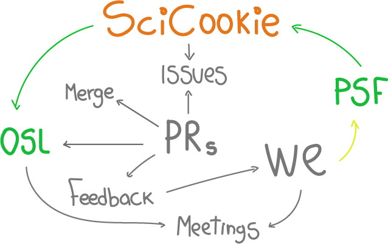

<!-- # PSF funding open source projects development: SciCookie -->
<!-- **By Anavelyz Perez & Yurely Camacho** -->

In this article, we will share our experience in applying for and executing a
Python Software Foundation (PSF) grant on behalf of Open Science Labs (OSL),
submitted between January and February 2023. The proposal was submitted to
contribute to the development and maintenance of SciCookie, a Python tool within
the [OSL incubation projects](https://opensciencelabs.org/programs/incubator/).

We'll begin by introducing SciCookie, highlighting its key features and aspects
that might interest you. Then, we'll go over the grant application process and
share our reflections on the experience, along with the lessons we learned.

## What is SciCookie?

As we mentioned at the beginning, SciCookie is a Python tool designed to provide
a Python project template. Its main goals are to simplify the process of
creating your projects and save you a considerable amount of time because,
according to your needs and planning, it gives you a starting point for the
configuration of your project. SciCookie provides several tools that are as
up-to-date as possible and adheres to community standards.

SciCookie is mainly based on PyOpenSci recommendations regarding the tools,
libraries, best practices and workflows employed by the significant Python
scientific groups. The elements we mention are listed as options, which means
that you can adapt various approaches in your project, through a text interface
(TUI) provided by SciCookie.

SciCookie is available from [PyPI](https://pypi.org/project/scicookie/) and
[conda](https://anaconda.org/conda-forge/scicookie). You can also visit its
repository at [GitHub](https://github.com/osl-incubator/scicookie).

Now that you know a bit about this project, let's tell you about PSF and how it
supports the Python community.

## What is PSF and how does it support the Python community?

The Python Software Foundation (PSF) is an organization dedicated to the
advancement and improvement of open source technologies. Its mission is to
promote, protect and advance the Python programming language. In addition, it
supports and facilitates the development/growth of the Python developers
community; a diverse and international community.

Among the programs that PSF promotes to achieve its mission, there is a _Grants
Program_, where proposals for projects related to the development of Python,
technologies associated with this programming language and educational
resources, are welcome. Since the creation of the program, PSF has supported
several interesting projects, you can click
[here](https://www.python.org/psf/records/board/resolutions/) to see the list or
have a clearer notion of the proposals, and maybe you will be encouraged to
apply with new projects or ideas.

You should know that the PSF in the grants program evaluates a number of aspects
in each proposal, including the usefulness of the project and the impact on the
Python community. In case you want to know more, we recommend you visit the
space that PSF has on its website for the
[grants program](https://www.python.org/psf/grants/).

So far, we have given you a brief overview of the main aspects of the two
parties involved: SciCookie and PSF. We will continue by telling you about the
grant application, what motivated us, the arranging and assigning tasks.

## What was the grant application process like?

The PSF grant application process was a long and challenging, but also very
rewarding. It began with careful planning and research. We studied the needs of
the scientific community and found a project that could help meet those needs.
In other words, we build on a strong case for the grant.

We were studying the different projects within the Open Science Labs incubation
program; where there are a series of approaches and technologies implemented,
including Python projects associated with DevOps, Data Science, and scientific
projects. The option that was best suited to apply for the grant in our case was
SciCookie; because it is a very useful tool and is focused on helping the Python
community.

After completing the planning and research, we began the formal application
process. This included completing an online form and submitting a detailed
proposal. The proposal contains a project description, timeline, budget and
impact section. In our case and in order to review each aspect carefully, we
produced a
[file with the responses](https://github.com/OpenScienceLabs/grant-proposals/blob/96263f736e7f36eb22a3dd1baa16376fd1782e98/psf_proposal.md)
[1] and filled in the budget scheme (template provided by the PSF). This process
was done under the advice of the OSL Steering Council.

In addition to the above, a series of issues were created and edited in the
project repository, in order to be clear about the activities to be carried out
and the time it would take to develop them in case the proposal was approved.

Once we had submitted our proposal, we had to wait some months for a decision.
It was a period of great uncertainty, but finally we received the news that our
proposal had been accepted!

## How was the workflow?

With the PSF grant, we were able to start developing and maintaining SciCookie
part-time. We worked with some community developers to add new features, improve
documentation and fix bugs. This included the creation of a
[user guide](https://github.com/osl-incubator/scicookie/blob/main/docs/guide.md)
to help enthusiasts and developers to use SciCookie.

In terms of task specification, as we described in the previous section, a
series of issues were generated in the project repository, and each one of us
handled some of the issues on a weekly basis via Pull Requests (PRs). These were
approved by members of the Open Science Labs team, who were also on hand
throughout the execution of the proposal.

Being a bit more specific about the follow-up, we had from an initial meeting
where we discussed the fundamental aspects of the project and set up what was
necessary to carry it out, to weekly meetings to present our progress, to check
if we had any obstacles or doubts that did not allow us to move forward.
Likewise, each PR was reviewed and if there were any observations, we had
feedback on this.

In summary, we can tell you that it was quite a dynamic workflow, where a
friendly space was built and allowed us to learn a lot.

> We would like to take this opportunity to thank
> [Ivan Ogasawara](https://github.com/xmnlab) and to
> [Ever Vino](https://github.com/EverVino), for their time and dedication. Both
> are active members of OSL and members of the steering council; they were there
> to support us and clarify our questions.

Here we tell you about our experience and the collaboration phase.

## How was our learning process?

SciCookie provided us, for the first time, with the opportunity to make such a
significant contribution to an open science and open source project. It also
allowed us to acquire new knowledge about some aspects and technologies linked
to the Python programming language, since at that time, our knowledge was more
oriented to the use of libraries, objects, loops, among others.

About this learning process we can tell you that we did not know many things and
it was necessary to learn along the way, sometimes this was a bit challenging
but, in general, very profitable. Among the anecdotes that we rescued is that, a
couple of times, we "exploded" the code and we didn't know why; the cause was
that we didn't know the exact use of single or double quotes, double braces,
spaces or tabs within the template. But then we were able to move forward and we
even made improvements in the workflow of the project.

Regarding the latter, we can certainly tell you that learning curves are always
steep. At the beginning you see everything uphill, but when you are familiar
with the technology and the tools, everything becomes easier. Daring is always
the first step.

On the other hand, if you are interested in collaborating on open source
projects, it is vital to have basic knowledge of Git and GitHub version control
tools, and to understand their essential commands such as git pull, git push,
git rebase, git log, git stash, among others. You may also need knowledge of
conda and poetry. We also learned a bit of jinja2 and make, and reviewed
knowledge of function creation, conditional evaluation, GitHub workflow,
documentation aspects and some of the technologies associated with it.

In summary, the experience of applying for and executing a PSF grant was a
valuable experience. We learned a lot about the process, how to develop and
maintain a Python tool, what structure a Python library or package project
should have, and how to build a community around an open source project. We are
also grateful for the support of the PSF, which has allowed us to make a
contribution to SciCookie. We feel satisfied with the work we have done and are
excited about the future of this tool.

To all that we have told you, we add an invitation to collaborate on open source
or open science projects and, if you have already done so, we encourage you to
continue to do so. We were often motivated by seeing our PRs being approved, we
shared feelings of achievement and new challenges and, most importantly, we were
applying what open source promotes: small collaborations make big changes and
add to the projects, achieving good and useful results.

After all this, you may wonder about the barriers to collaboration. We dedicate
the following lines to describe what we rescued from our experience.

## Can you find barriers to collaboration?

The progress of your contributions depends on you. It is vital to ask questions
and not get bogged down by doubts. Often there is someone who can show you that
the problem you thought was big was simply a small one, perhaps the code didn't
work because it was single quotes instead of double quotes, for example.

From the OSL community we can highlight that it focuses on creating friendly,
opportunity-filled spaces where you can share and acquire new knowledge,
eliminating barriers and discrimination. Perhaps you can find these same
characteristics in other open science and/or open source projects.

That's why we want to invite you again to support and join the diverse Python
and open source community. It's an excellent experience and the fact of
contributing to something that can be useful to other people is quite
satisfying.

In general, collaborating on open source projects is a great way to improve your
programming skills, you also have the opportunity to work with other developers
and learn from them, get feedback on your work. If you want to support or boost
your project, the first thing to do is to get started. Many communities are open
to new contributions and innovative ideas.

Leave us your comments if you want to know more about what we have told you in
this space :D

[1] **Additional note**: SciCookie originally went by the name of
cookiecutter-python and then renamed to osl-python-template.

<small size="0">Graphic elements of the cover were extracted from
[Work illustrations by Storyset](https://storyset.com/work), and then edited to
conform to the article.</small>
