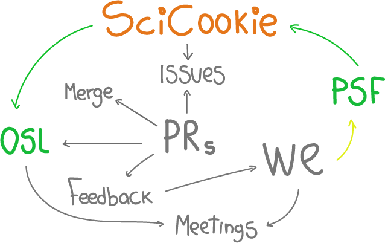

<!-- # PSF financiando el desarrollo de proyectos open source: SciCookie -->
<!-- **Por Anavelyz Perez & Yurely Camacho** -->

En este artículo, compartiremos nuestra experiencia en la solicitud y ejecución
de una subvención de la Python Software Foundation (PSF) a nombre de Open
Science Labs (OSL) que fue enviada entre enero y febrero de 2023. La propuesta
se hizo con la finalidad de contribuir con el desarrollo y mantenimiento de
SciCookie, una herramienta de Python que se encuentra dentro de los
[proyectos de incubación de OSL](/projects/incubation/).

Comenzaremos con una breve introducción a SciCookie, algunas de sus
características clave y aspectos de interés. Luego, discutiremos el proceso de
solicitud de la subvención y haremos algunas reflexiones sobre la experiencia y
lo que aprendimos.

## ¿Qué es SciCookie?

Como te mencionamos al inicio, SciCookie es una herramienta de Python diseñada
para proveer una plantilla de proyecto Python. Sus principales objetivos son
simplificar el proceso de creación de tus proyectos y ahorrarte una cantidad
considerable de tiempo porque, de acuerdo a tus necesidades y planificación, te
da un punto de partida para la configuración de tu proyecto. SciCookie
proporciona varias herramientas lo más actualizadas posibles, además se adhiere
a los estándares de la comunidad.

Esto último es porque SciCookie, se basa principalmente en las recomendaciones
de PyOpenSci en lo que se refiere a las herramientas, bibliotecas, mejores
prácticas y flujos de trabajo empleados por los grupos científicos
significativos de Python. Los elementos que mencionamos se encuentran como
opciones, lo que significa puedes adaptar diversos enfoques en tu proyecto,
mediante una interfaz de texto (TUI) que te proporciona SciCookie.

SciCookie está disponible en [PyPI](https://pypi.org/project/scicookie/) y
[conda](https://anaconda.org/conda-forge/scicookie). También puedes visitar su
repositorio en [GitHub](https://github.com/osl-incubator/scicookie).

Ahora que ya conoces un poco sobre este proyecto, te contamos un poco sobre PSF
y cómo apoya a la comunidad Python.

## ¿Qué es PSF y cómo apoya a la comunidad?

La Python Software Foundation (PSF) es una organización dedicada al avance y
mejora de las tecnologías de código abierto. Su misión es promover, proteger e
impulsar el lenguaje de programación Python. Además, apoya y facilita el
desarrollo/crecimiento de la comunidad de programadores Python; una comunidad
diversa e internacional.

Entre los programas que promueve PSF para lograr su misión, se encuentra un
Grants Program (programa de subvenciones), donde las propuestas para proyectos
relacionados con el desarrollo de Python, tecnologías asociadas a este lenguaje
de programación y recursos educacionales, son bienvenidas. Desde la creación del
programa, PSF ha apoyado varios proyectos interesantes, puedes hacer clic
[aquí](https://www.python.org/psf/records/board/resolutions/) para ver la lista
o tengas una noción más clara de las propuestas, y quizá te animes a aplicar con
nuevos proyectos o ideas.

Continuando con el programa de subvenciones, debes conocer que la PSF evalúa una
serie de aspectos en cada propuesta, entre ellos la utilidad del proyecto y el
impacto en la comunidad Python. En caso de que desees conocer más, te
recomendamos visitar el espacio que tiene PSF en su página web para el
[grants Program](https://www.python.org/psf/grants/).

Hasta ahora y de manera resumida, te hemos relatado los principales aspectos
sobre las dos partes involucradas: SciCookie y PSF. Proseguiremos contándote
sobre la solicitud de la subvención, lo que nos motivó y la división de nuestras
tareas.

## ¿Cómo fue el proceso de solicitud del grant o subvención?

El proceso de solicitud de subvención de la PSF fue un proceso largo y
desafiante, pero también muy gratificante. Comenzó con una cuidadosa
planificación e investigación. Debíamos comprender las necesidades de la
comunidad científica y encontrar un proyecto que pudiese ayudar a satisfacerlas.
Es decir, se requería desarrollar un caso sólido para la subvención.

En vista de esto, hicimos un estudio de los distintos proyectos dentro del
programa de incubación de Open Science Labs; donde hay diferentes enfoques y
tecnologías implementadas, incluyendo proyectos en Python asociados a DevOps,
Data Science, y proyectos científicos. La opción que mejor se adaptó para
solicitar la subvención en nuestro caso fue SciCookie; porque es una herramienta
bastante útil y se encuentra enfocada en ayudar a la comunidad Python.

Después de completar la planificación y la investigación, comenzamos el proceso
de solicitud formal. Esto incluyó completar un formulario en línea y presentar
una propuesta detallada. La propuesta contiene una descripción del proyecto, un
cronograma, un presupuesto y una sección de impacto. En nuestro caso y para
revisar con detenimiento cada aspecto elaboramos un
[archivo con las respuestas](https://github.com/OpenScienceLabs/grant-proposals/blob/96263f736e7f36eb22a3dd1baa16376fd1782e98/psf_proposal.md)
[1] y llenamos el esquema del presupuesto (plantilla proporcionada por la PSF).
Este proceso se hizo bajo la asesoría del Steering Council de OSL.

Además de lo anterior, se crearon y editaron una serie de issues en el
repositorio del proyecto, para tener claras las actividades a realizar y el
tiempo que tomaría desarrollarlas en caso de que fuese aprobada la solicitud.

Una vez realizada la presentación de la propuesta por nuestra parte, tuvimos que
esperar varios meses para recibir una decisión. Fue un período de gran
incertidumbre, pero finalmente recibimos la noticia de que nuestra propuesta
había sido ¡aceptada!

## ¿Cómo fue el flujo de trabajo?

Con la subvención de la PSF, pudimos comenzar a desarrollar y mantener SciCookie
a medio tiempo. Trabajamos con algunos desarrolladores de la comunidad para
agregar nuevas funcionalidades, mejorar la documentación y corregir errores o
bugs. Entre esto destacamos la creación de una
[guía de usuario](https://github.com/osl-incubator/scicookie/blob/main/docs/guide.md)
para ayudar a los entusiastas y desarrolladores a aprender a utilizar SciCookie.

En cuanto la especificación de las tareas, como te mencionamos en la sección
anterior, se crearon una serie de issues en el repositorio del proyecto, y en
base en esto cada una resolvía semanalmente varios de los issues mediante Pull
Requests (PRs). Estos eran aprobados por miembros del equipo de Open Science
Labs, quiénes además estuvieron al pendiente durante toda la ejecución de la
propuesta.

Siendo un poco más específicas sobre el seguimiento, tuvimos desde una reunión
inicial donde abordamos los aspectos fundamentales del proyecto y configuramos
lo necesario para llevarlo a cabo, hasta reuniones semanales para presentar
nuestros avances, verificar si se nos había presentado alguna traba o duda que
no nos permitiera avanzar. Así mismo, cada PR era revisado y si existía alguna
observación, teníamos feedback sobre esto.

En resumen, te podemos decir que fue un flujo de trabajo bastante dinámico,
donde se construyó un espacio amigable y nos permitió aprender bastante.

> Aprovechamos este espacio para agradecer a
> [Ivan Ogasawara](https://github.com/xmnlab) y a
> [Ever Vino](https://github.com/EverVino), por su tiempo y dedicación. Ambos
> son miembros activos de OSL y parte del steering council; estuvieron
> apoyándonos y aclarando nuestras dudas.

A continuación te contamos sobre nuestra experiencia y la etapa de colaboración.

## ¿Cómo fue nuestro proceso de aprendizaje?

SciCookie nos brindó, por primera vez, la oportunidad de hacer una contribución
tan significativa en un proyecto de ciencia abierta y open source. También nos
permitió adquirir nuevos conocimientos sobre algunos aspectos y tecnologías
ligadas al lenguaje de programación Python, ya que en ese momento, nuestros
conocimientos estaban más orientados al uso de bibliotecas, objetos, bucles,
entre otros.

Sobre este proceso de aprendizaje podemos decirte que desconocíamos muchas cosas
y fue necesario aprender en el camino, en ocasiones esto se nos tornó un poco
desafiante pero, en general, muy provechoso. Entre las anécdotas que rescatamos
está que, un par de veces, nos “explotó” el código y no sabíamos el porqué; la
causa era que no sabíamos el uso exacto de comillas simples o dobles, doble
llaves, espacios o tabulaciones dentro de la plantilla. Pero ya luego pudimos
avanzar e incluso hicimos mejoras en el workflow del proyecto.

Con relación a esto último, sin duda podemos comentarte que las curvas de
aprendizaje siempre son empinadas. Al principio ves todo cuesta arriba, pero
cuando ya estás familiarizado con la tecnología y las herramientas, todo se
vuelve más fácil. Atreverse siempre es el primer paso.

Por otro lado, si te interesa colaborar en proyectos de código abierto, es vital
tener conocimientos básicos de herramientas de control de versiones Git y
GitHub, y entender sus comandos esenciales como git pull, git push, git rebase,
git log, git stash, entre otros. También puedes necesitar conocimientos sobre
conda y poetry. Nosotras además de esto, aprendimos un poco de jinja2 y make, y
repasamos conocimientos de creación de funciones, evaluación de condicionales,
workflow de GitHub, aspectos de documentación y algunas tecnologías asociadas a
esto.

En resumen, la experiencia de solicitar y ejecutar una subvención de la PSF fue
una experiencia valiosa. Aprendimos mucho sobre el proceso, cómo desarrollar y
mantener una herramienta de Python, qué estructura debe tener un proyecto de
biblioteca o paquete Python y cómo construir una comunidad alrededor de un
proyecto de código abierto. También estamos agradecidos por el apoyo de la PSF,
que nos ha permitido hacer un aporte a SciCookie. Nos sentimos satisfechas del
trabajo que hemos realizado y estamos emocionadas por el futuro de esta
herramienta.

A todo lo que te hemos comentado, le sumamos una invitación a que colabores en
proyectos de código abierto o ciencia abierta y, si ya lo has hecho, te animamos
a que continúes haciéndolo. A nosotras muchas veces nos motivaba el hecho de ver
nuestros PRs siendo aprobados, compartimos sentimientos de logro y nuevos retos
y, lo más importante es que estuvimos aplicando lo que promueve el open source o
código abierto: pequeñas colaboraciones hacen grandes cambios y van sumando a
los proyectos, logrando buenos y útiles resultados.

Luego de todo esto, quizá te puedas preguntar sobre las barreras en la
colaboración. Dedicamos las siguientes líneas para describir lo que rescatamos
de nuestra experiencia.

## ¿Puedes encontrar barreras en la colaboración?

El progreso de tus contribuciones depende de ti. Es vital preguntar y no
estancarse con las dudas. A menudo hay alguien que puede mostrarte que el
problema que considerabas grande simplemente era algo pequeño, tal vez el código
no funcionaba porque eran comillas simples en lugar de comillas dobles, por
ejemplo.

De la comunidad de OSL podemos destacar que se centra en crear espacios
amigables y llenos de oportunidades en los que puedas compartir y adquirir
nuevos conocimientos, eliminando barreras y la discriminación. Quizá puedes
encontrar estas mismas características en otros proyectos de ciencia abierta y/o
código abierto.

Por eso te queremos invitar nuevamente a apoyar y unirte a la diversa comunidad
de Python y del open source, es una excelente experiencia y el hecho de
contribuir en algo que puede ser útil a otras personas es bastante
satisfactorio.

En general, colaborar en proyectos de código abierto es una insuperable manera
de mejorar tus habilidades de programación, también tienes la oportunidad de
trabajar con otros desarrolladores y aprender de ellos, recibir
retroalimentación sobre tu trabajo. Si deseas apoyar o darle un impulso a tu
proyecto, lo primero que debes hacer es empezar. Muchas comunidades están
abiertas a nuevos aportes e ideas innovadoras.

Déjanos tus comentarios si deseas conocer más detalles sobre lo que te hemos
contado en este espacio :D

[1] **Nota adicional**: SciCookie originalmente llevaba por nombre
cookiecutter-python y luego pasó a ser osl-python-template.

<small size="0">Elementos gráficos de la portada fueron extraídos de
[Work illustrations by Storyset](https://storyset.com/work), y luego editados
para adaptarlos al artículo.</small>
